# zmk-config

> [!WARNING]\
> Under active development, incomplete documentation. Use at your own risk.

This is my personal [zmk-config](https://zmk.dev/) for my ergo keyboards.

## Boards and Keymaps

<a href="https://github.com/zigotica/mechanical-keyboards/tree/main/z34">z34</a>: for simplicity purposes, I am reusing the cradio shield which is also a direct pin 34 keys split keyboard.

_(keymap image created with [caksoylar/keymap-drawer](https://github.com/caksoylar/keymap-drawer))_

## Utilities

I added a pre-commit hook (you have to run `./bin/setup`) that parses all the keymaps and generates an SVG for each keyboard and also a specific SVG for each of their layers. I could've used the workflows to generate the complete SVG, but I want to document each of the layers separately (pending).

## Inspiration

- [caksoylar/zmk-config](https://github.com/caksoylar/zmk-config)
- [englmaxi/zmk-config](https://github.com/englmaxi/zmk-config)
- [minusfive/zmk-config](https://github.com/minusfive/zmk-config)
- [urob/zmk-config](https://github.com/urob/zmk-config)

